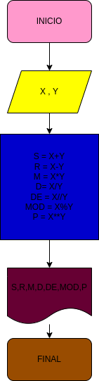

# ejercicio 3

## suma, resta, multiplicación, división, división entera, modulo y potencia de 2 numeros
 
# ANALISIS
variable de entrada

x , y
variables de proceso y salida ( processing, storage, output)

S: suma
R: resta
M: multiplicación
D: división
DE: división entera
MOD: modulo
P: potencia

# DISEÑO

# CONSTRUCCION

